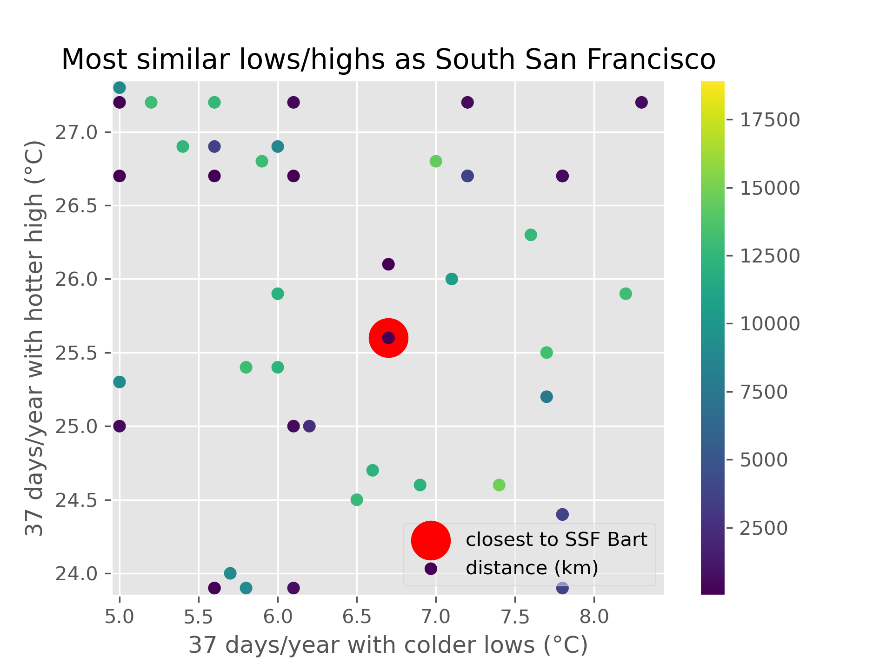

## Steps
Install Node and Git. Run
```
git clone https://github.com/fasiha/hareonna.git
cd hareonna
npm i
```

Download
- https://www.ncei.noaa.gov/pub/data/ghcn/daily/ghcnd-stations.txt (10 MB)
- https://www.ncei.noaa.gov/pub/data/ghcn/daily/ghcnd-inventory.txt (33 MB)

Run:
```
node jsonify_stations.js
node filter_stations.js
```
This will generate a couple of JSON files and a text file.

Now, if you have `xargs` and `shuf` and `wget`, run:
```
cat good-stations-urls.txt | shuf | xargs -n10 -P4 wget --continue
```
(If you don't have all these fancy command line utilities, use `wget --continue -i good-stations-urls.txt`.)

It's going to download ~40 GB.

Process the CSVs themselves to extract percentiles:
```
node closest_station.js
```

Finally, you need a bunch of Python to render some maps (coming soon to JavaScript/browser):
```bash
# requires numpy, matplotlib, basemap, basemap-data-hires (conda-forge package)
python plots.py
```

This generates a list of most similar weather stations: [closest.md](./closest.md).

And some plots: these are *very* hard to read, sorry! I'll make them into browser apps shortly:




## Notes

All: https://www.ncei.noaa.gov/data/global-historical-climatology-network-daily/access/


- Tehachapi: USC00048829
- SFO: USW00023234

https://www.ncei.noaa.gov/data/global-historical-climatology-network-daily/access/USC00048829.csv

https://nominatim.org/release-docs/develop/api/Search/
- https://nominatim.openstreetmap.org/search?q=tehachapi&format=json