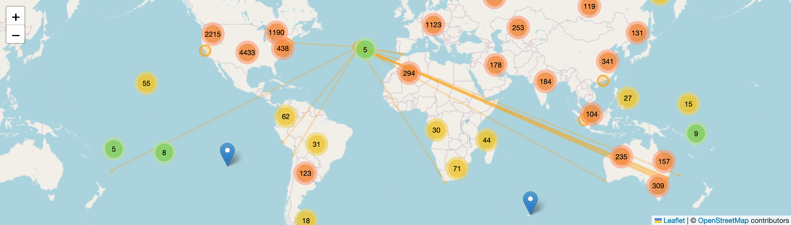

# Hareonna
## Web app
There's a React web app to visualzie this data: https://fasiha.github.io/hareonna/

It produces pretty graphs like [this](https://fasiha.github.io/hareonna/#s:USW00023234,s:USW00094728,s:MCM00045011,s:SNM00048698,s:POM00008501), comparing San Francisco, New York City, Macau, Singapore, and Flores in the Azores:


and maps like this:



Here's my [introductory blog post](https://fasiha.github.io/post/hareonna-global-weather/).

## Data generation steps
Install [Node](https://nodejs.org) and [Git](https://git-scm.com). Run
```
git clone https://github.com/fasiha/hareonna.git
cd hareonna
npm i
```

Download into this `hareonna` directory the following files:
- https://www.ncei.noaa.gov/pub/data/ghcn/daily/ghcnd-stations.txt (10 MB)
- https://www.ncei.noaa.gov/pub/data/ghcn/daily/ghcnd-inventory.txt (33 MB)
- https://www.ncei.noaa.gov/data/global-historical-climatology-network-daily/archive/daily-summaries-latest.tar.gz (7.1 GB as if 2022 June)

Run:
```
node jsonify_stations.js
node filter_stations.js
node closest_station.js
```
This outputs a small <10 MB file, `good-stations-summary.json`, with a number of percentiles for temperature highs/lows for all "good" weather stations that have had temperature data for the last three years (though some stations may have (considerable) missing temperature data within the three year period).

## Python visualization
Finally, you need a bunch of Python to render some maps (coming soon to JavaScript/browser):
```bash
# requires numpy, matplotlib, basemap, basemap-data-hires (conda-forge package)
python plots.py
```

This generates a list of most similar weather stations: [closest.md](./closest.md) and some plots.

## Web app build
I use GitHub Pages to serve the contents of the `gh-pages` branch as a static site on https://fasiha.github.io/hareonna/.

To set it up, I use [Kris Jenkins'](http://blog.jenkster.com/2016/02/git-for-static-sites.html) tip to check out the `gh-pages` branch as a Git worktree. Starting in a checkout of this repo:
```bash
git worktree add ../hareonna-dist gh-pages
```

Then every time I want to rebuild the site, I run the following script:
```bash
rmtrash ../hareonna-dist/*
git rev-parse HEAD > ../hareonna-dist/source-sha.txt
npm run build-static && cp -pr out/* ../hareonna-dist && cd ../hareonna-dist && git add . && git commit -am dist --amend && git push -f && cd -
```
(`rmtrash` is my alias for a safe `rm`, feel free to replace this with `rm -fr`.)

## Notes

All: https://www.ncei.noaa.gov/data/global-historical-climatology-network-daily/access/


- Tehachapi: USC00048829
- SFO: USW00023234

https://www.ncei.noaa.gov/data/global-historical-climatology-network-daily/access/USC00048829.csv

https://nominatim.org/release-docs/develop/api/Search/
- https://nominatim.openstreetmap.org/search?q=tehachapi&format=json